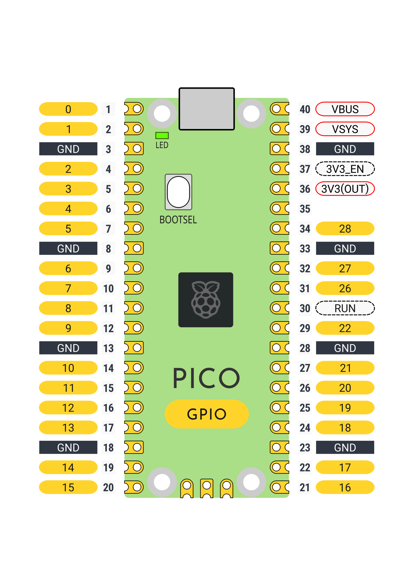

# GPIO Pin Diagram for Raspberry Pi Pico

If you need to look up more mappings then https://picow.pinout.xyz/ or the [Pico Documentation](https://www.raspberrypi.com/documentation/microcontrollers/pico-series.html) has what you need. Look at it on dark/light mode [here](https://files.veeb.ch/raspberry-pi-pico-gpio-pinout.html).

. 
